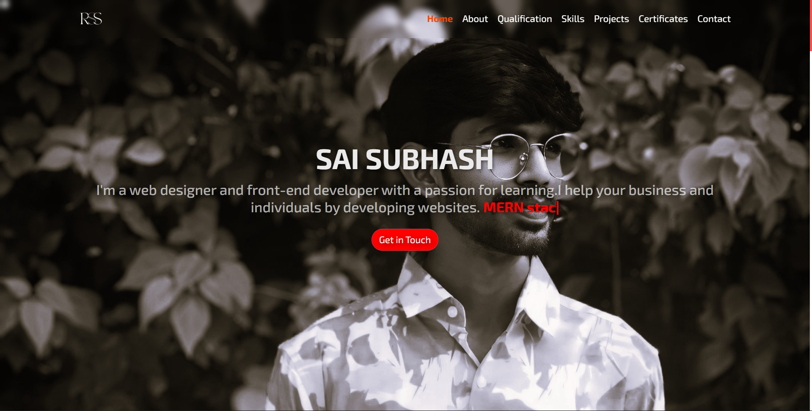

# Professional Portfolio  

  

<p align="center">
  <a href="https://subhash-portfolio-main.vercel.app/">
    
  </a>
  <a href="https://github.com/ramanojusaisubhash/Professional-Portfolio">
    
  </a>
  <a href="https://www.linkedin.com/in/ramanojusaisubhash">
    
  </a>
  <a href="https://opensource.org/licenses/MIT">
    
  </a>
</p>

---

## 🚀 About the Project  
This is my **personal professional portfolio website** built using **React.js**. It showcases my skills, projects, qualifications, and achievements in a clean and responsive design.  

🔗 **Live Demo:** [subhash-portfolio-main.vercel.app](https://subhash-portfolio-main.vercel.app/)  

---

## 📂 Project Structure  

```
PORTFOLIO/
├── build/
├── node_modules/
├── public/
├── src/
│   ├── assets/
│   ├── components/
│   │   ├── About.css
│   │   ├── About.js
│   │   ├── Certificates.css
│   │   ├── Certificates.js
│   │   ├── Contact.css
│   │   ├── Home.css
│   │   ├── Home.js
│   │   ├── Navbar.css
│   │   ├── Navbar.js
│   │   ├── project.css
│   │   ├── Projects.js
│   │   ├── Qualification.css
│   │   ├── Qualification.js
│   │   ├── ScrollToTop.css
│   │   ├── ScrollToTop.js
│   │   ├── Skills.css
│   │   ├── Skills.js
│   │   └── ThemeToggle.js
│   ├── styles/
│   ├── App.css
│   ├── App.js
│   ├── App.test.js
│   ├── index.css
│   ├── index.js
│   ├── reportWebVitals.js
│   └── setupTests.js
├── .gitignore
├── package-lock.json
```

---

## 🛠️ Tech Stack  

- **Frontend:** React.js, CSS  
- **Deployment:** Vercel  
- **Version Control:** Git, GitHub  

---

## 🌟 Features  

✔️ Responsive and modern design  
✔️ Dark/Light mode toggle  
✔️ Smooth scrolling and navigation  
✔️ Sections: Home, About, Skills, Projects, Certificates, Qualification, Contact  
✔️ Project links to live demos  

---

## 📸 Screenshot  

  

---

## 🔗 Links  

- **Portfolio Website:** [subhash-portfolio-main.vercel.app](https://subhash-portfolio-main.vercel.app/)  
- **GitHub Repo:** [Professional-Portfolio](https://github.com/ramanojusaisubhash/Professional-Portfolio)  
- **LinkedIn:** [Sai Subhash Ramanoju](https://www.linkedin.com/in/ramanojusaisubhash)  
- **GitHub Profile:** [ramanojusaisubhash](https://github.com/ramanojusaisubhash)  

### 📌 Individual Projects  
- [CRUD Application](https://main-crud-app.onrender.com/)  
- [Portfolio Website](https://subhash-portfolio-main.vercel.app/)  

---

## ⚙️ Installation & Setup  

1. Clone the repository  
   ```bash
   git clone https://github.com/ramanojusaisubhash/Professional-Portfolio.git
   ```
2. Navigate to the project folder  
   ```bash
   cd Professional-Portfolio
   ```
3. Install dependencies  
   ```bash
   npm install
   ```
4. Start the development server  
   ```bash
   npm start
   ```

---

## 📜 License  

This project is licensed under the **MIT License**.  
